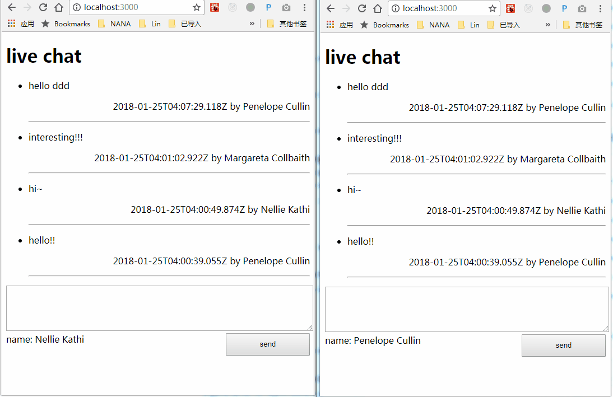

# node-realtime-db

realtime database for nodejs, support for react. I mean firebase-lite or redux-server

node.js的实时数据库，支持react，有点像firebase和redux的合体



[online demo](https://test-qvothdqjjn.now.sh/)

## server side | 服务端

```
var app = require('http').createServer(handler)
require('node-realtime-db-server')(app)
```

## client side | 客户端

```
import Db from 'node-realtime-db-client'

const db = new Db('http://localhost/rtdb')

db.get('path.key').then((value)=>{
  alert(value)
})

db.watch('path.key',(value)=>{
  alert(value)
})

db.update('path.key.sub','z')

```

## react | react使用

`provider` page

```
import { Provider } from 'react-node-realtime-db-react'

export default ()=>(<Provider db={dburl}>
  <App />
</Provider>)

```

`connect` in component

```
import { connect } from 'react-node-realtime-db-react'

const App = (props)=>{
  const { a, b } = props
  return (<p>{JSON.stringify(data)}</p>)
}

export default connect({a:'path.a', b:'b'})(App)

```

## test | 本地验证

```
git clone https://github.com/postor/node-realtime-db.git
cd test
yarn && yarn dev
```

then open http://localhost:3000 and use more tabs to check is it real time

然后打开 http://localhost:3000 并使用多个tab来验证它是实时的


## api documents | 接口说明

incr/decr for number and push/splice for array on server refer [options api](./operations.md)

针对数字的incr/decr和数组的push/splice等操作请参考 [options api](./operations.md)

special paths, right now `user` only, [special paths](./special-paths.md)

特殊的路径，目前只有`user`，[special paths](./special-paths.md)

## custom adapters | 定制数据适配器

data by default stored in memory, you may want to store your data to disk or mongodb or else, then you can custom db adapter

默认数据都存放在内存中了，如果你想把数据存到磁盘或者mongodb或者其他地方，你可以自己定制数据适配器

```
const Adapter = require('node-realtime-db-server').Adapter

class CustomAdapter extends Adapter {
  constructor(dbOptions = {}) {
    super(dbOptions)
    //use dbOptions for your init    
  }
  async get(path) {
    //return value of path
  }
  async update(path, newValue) {
    //update and return new value
  }
  async incr(path, toIncr, value) {
    //incr and return new value
  }
  async decr(path, toDecr, value) {
    //decr and return new value
  }
  async push(path, item, value) {
    //push and return new value
  }
  async unshift(path, item, value) {
    //push and return new value
  }
  async splice(path, args, value) {
    //splice and return new value
  }
}

rtdb.default(http, {}, {
  Adapter: CustomAdapter,
  //and your custom dbOptions
})

```

here is an example to store data in a json file [JsonAdapter.js](./test/JsonAdapter.js)

这是一个把数据保存到 json 文件的例子 [JsonAdapter.js](./test/JsonAdapter.js)